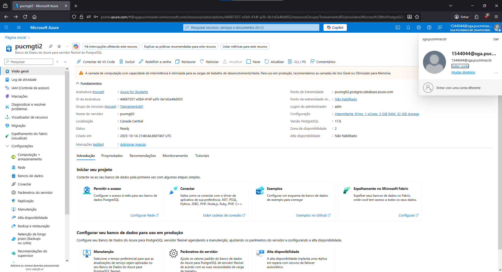
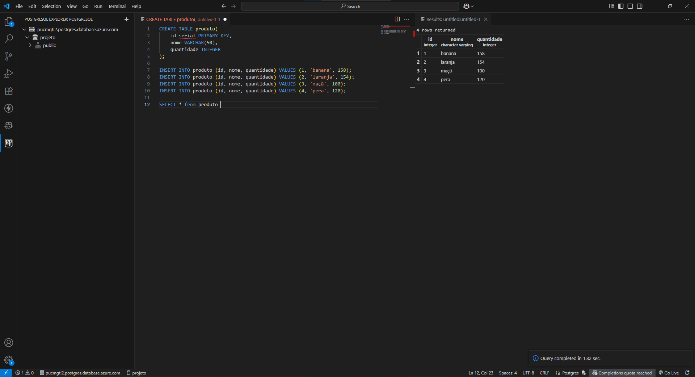

# Exercício 04: Computação em Nuvem e IA como Serviço 

### Produto 1: Conta ativada no Azure

 

 

### Produto 2: Banco de dados criado com PostgreSQL no Azure
- Banco de dados Criado no Azure

 
- Conexão com o banco de dados e resultado da query SQL de seleção (select)
