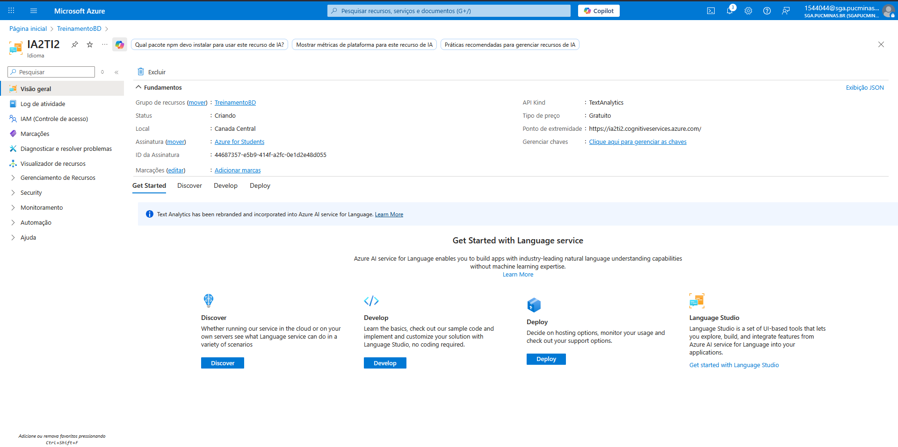
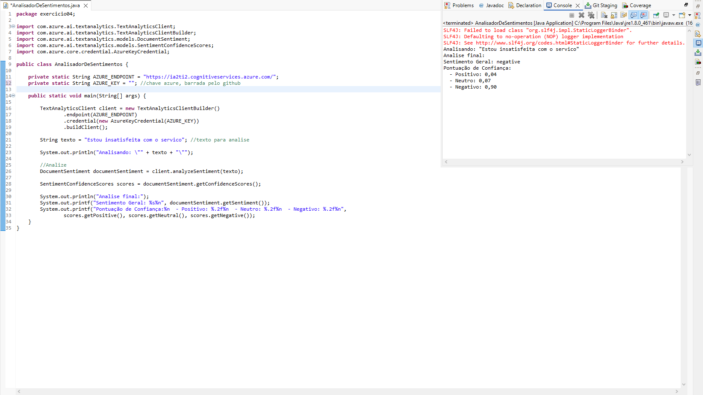

# Exercício 04: Computação em Nuvem e IA como Serviço 

### Produto 1: Conta ativada no Azure

 

 

### Produto 2: Banco de dados criado com PostgreSQL no Azure
- Banco de dados Criado no Azure

 

- Conexão com o banco de dados e resultado da query SQL de seleção (select)

### Produto 3: Crie, publique e use modelos

- <b>Opção B:</b> Serviços Cognitivos: Utilizando o Serviço de Idioma de IA do Azure

 
- Demonstração do código em funcionamento
<a href="exercicio04/src/main/java/exercicio04/AnalisadorDeSentimentos.java">Código em java</a>
